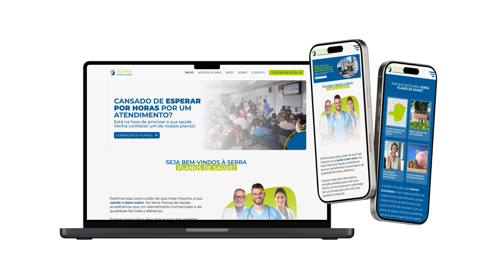

# 🌟 Serra Planos - Website Oficial

Bem-vindo ao repositório oficial do site **Serra Planos**, uma plataforma moderna e responsiva desenvolvida para apresentar informações sobre planos de saúde com eficiência e acessibilidade.

---

## 🌐 Acesso ao site

👉 **URL Pública**: [serra-planos.netlify.app](https://serra-planos.netlify.app)

---

## 📋 Funcionalidades

### 🏆 Principais características do site:

- **🏥 Informações completas** sobre os planos de saúde oferecidos.
- **📱 Design responsivo** para smartphones, tablets e desktops.
- **💬 Integração com WhatsApp** para atendimento rápido.
- **⚡ Performance otimizada** para garantir uma experiência rápida e fluida.
- **🔍 Navegação intuitiva** com links claros e menus organizados.

---

## 🛠️ Tecnologias Utilizadas

| Tecnologia                                                                                                                                                                                                                                                                                                                               | Descrição                    |
| ---------------------------------------------------------------------------------------------------------------------------------------------------------------------------------------------------------------------------------------------------------------------------------------------------------------------------------------- | ---------------------------- |
|                                                                                                                                                                                                                                 | Estrutura do site            |
|                                                                                                                                                                                                                                    | Estilos e responsividade     |
|                                                                                                                                                                                                                  | Funcionalidades dinâmicas    |
|                                                                                                                                                                                                                           | Hospedagem e deploy contínuo |
|                                                                                                                                                                                                                                       | Controle de versão           |
| 
SWIPERJS
 | Criação de carrossel         |

---

## 🎨 Design

O site foi projetado com um foco especial em acessibilidade, usabilidade e visual moderno.

### Paleta de Cores

   
#005998

   
#B1C900

   
#FAFAFA

   
#262626

---

## 🚀 Deploy e Hospedagem

O site está hospedado no **Netlify**, utilizando deploy contínuo. Toda alteração realizada no repositório principal é automaticamente aplicada ao site publicado.

### URL do Site

🔗 [https://serra-planos.netlify.app](https://serra-planos.netlify.app)

---
